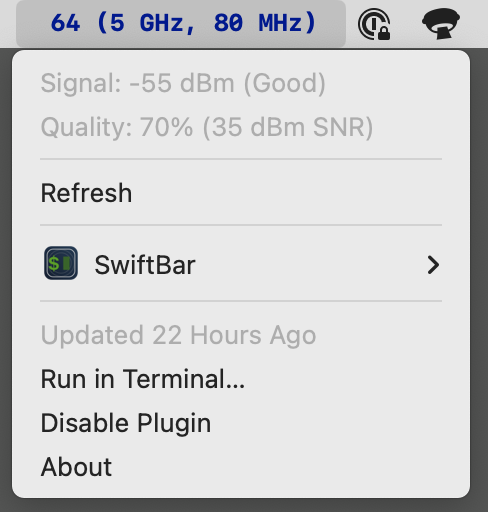

# wireless_status

Apple's `airport` command-line tool, long hidden in a private framework (`/System/Library/PrivateFrameworks/Apple80211.framework/Versions/A/Resources/airport`), is deprecated as of macOS Sonoma (14.5 as of this writing). It looks like it was originally intended to be public, and has a hilarious man page dated 2/1/2010 (`airport more information needed here`)...

The recommended command-line replacement, `wdutil(8)`, requires running as root and does way more than I wanted from `airport`.

I used `airport` to display the current signal strength, channel, etc. in [SwiftBar](https://github.com/swiftbar/SwiftBar). Where I live, I only have Wi-Fi access to the Internet, and often experience interference due to the density of Wi-Fi capable devices on my desk. (I do disable Wi-Fi everywhere I can, but sometimes have to enable it to make use of [AWDL](https://owlink.org/wiki/)/[Continuity](https://support.apple.com/en-us/102418) services.)

The included Xcode project implements a replacement for `airport` using public API. The shell script predecessor parsed `airport`'s output whereas this version directly outputs in a format SwiftBar understands; since SwiftBar wants to see a shell script, I included a simple wrapper that expects the binary be installed in `/usr/local/bin`.

## Screenshot

